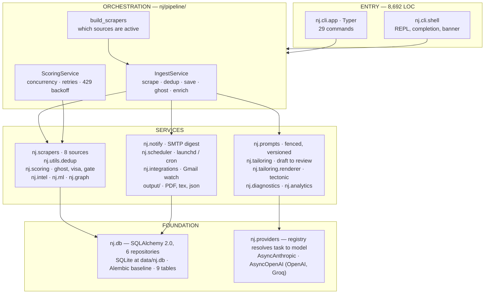
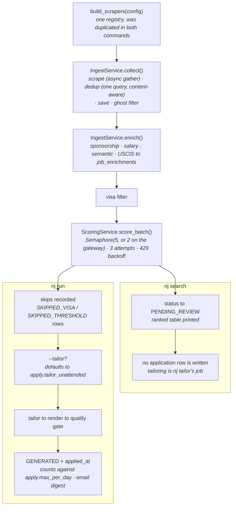
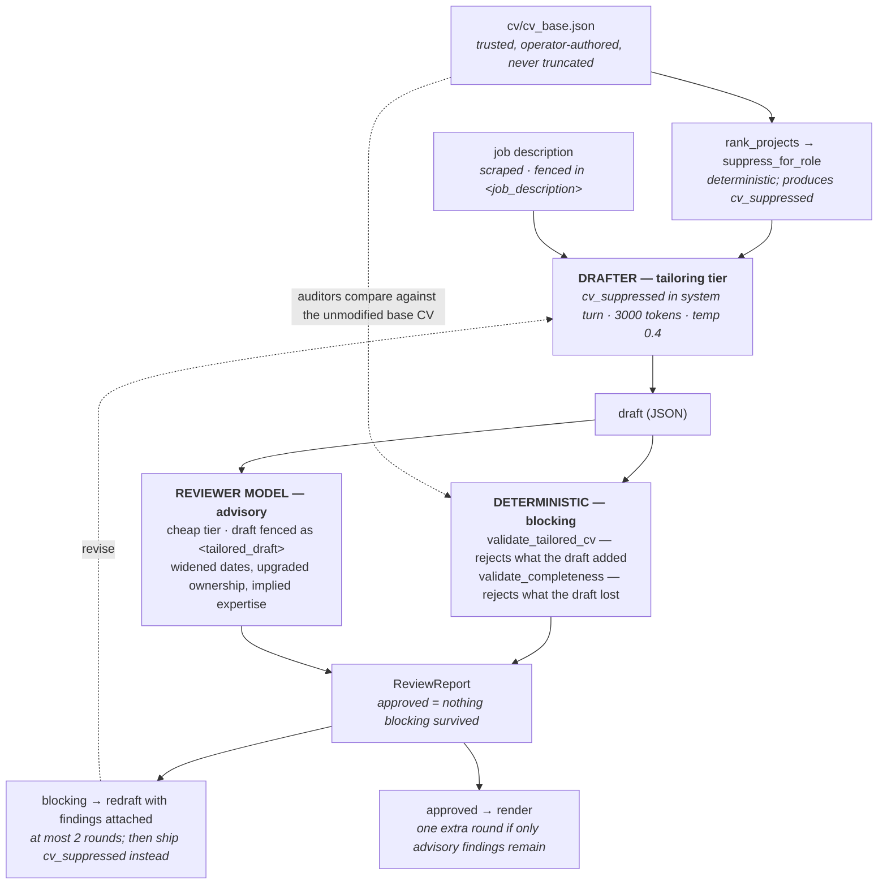
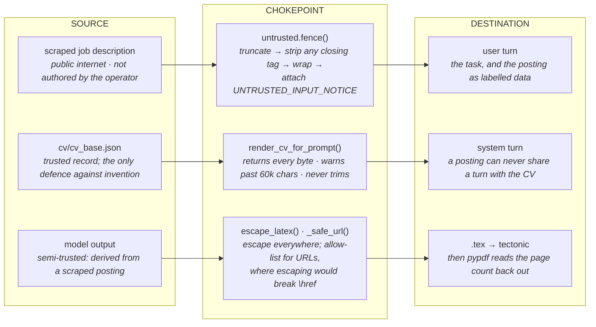

# nj-cli — Architecture and System Design

**Last verified against the source: 2026-08-18** (nj-cli v1.2.0, after the backlog pass on branch `fix/architecture-backlog`)

Published as a browsable page: <https://claude.ai/code/artifact/328ca114-f10c-46b4-9299-d147d631f6e1>

> **Keeping this current.** This file is the authority; the artifact is a rendering of
> it. Update both together whenever a section it describes changes — see
> [Maintaining this document](#maintaining-this-document) at the end. Every number
> here was measured, not estimated; if you change something it counts, re-measure.

| | |
|---|---|
| Lines in `nj/` | 19,852 |
| Modules / packages | 138 / 22 |
| Commands | 29 |
| Tables | 9 |
| Tests | 751 passing, 3 skipped |
| Coverage | 65% (floor 62%) |

---

## Contents

1. [Design stance](#1--design-stance)
2. [System map](#2--system-map)
3. [Package inventory](#3--package-inventory)
4. [Command surface](#4--command-surface)
5. [The two pipelines](#5--the-two-pipelines)
6. [Stage by stage](#6--stage-by-stage)
7. [Drafter and reviewer](#7--drafter-and-reviewer)
8. [Trust boundaries](#8--trust-boundaries)
9. [Provider layer](#9--provider-layer)
10. [Data model](#10--data-model)
11. [Application lifecycle](#11--application-lifecycle)
12. [Configuration and secrets](#12--configuration-and-secrets)
13. [Quality gates](#13--quality-gates)
14. [Ground truth](#14--ground-truth)
15. [Recommendations](#15--recommendations)

---

## 1 · Design stance

nj is not a job-application bot. It is a preparation engine with a hard stop before
the send button, and most of its unusual structure follows from defending that line
and two others.

### Prepare, never submit

The pipeline writes `ApplicationStatus.GENERATED` — "CV and letter on disk, nothing
sent" — and there is no code path that writes `SUBMITTED`. Only a human promotes a
row, with `nj status --update-id <id> --update-status submitted`.
`nj/applying/linkedin_easy.py` exists solely to *raise* `EasyApplyDisabledError`, so
anything that tries to auto-send fails loudly rather than silently recording a
submission that never happened. `nj/scrapers/linkedin.py` is an inert stub for the
same reason: cookie-driven automation of the operator's own account risks a permanent
ban on the account they job-hunt from.

### A tailored CV may lose detail; it may never gain a fact

Two deterministic validators run on every draft, and they are exact mirrors of each
other. `validate_tailored_cv` rejects what the model *added*; `validate_completeness`
rejects what it *lost*. Both block. Neither is a model — they are set comparisons
against the base CV, so nothing in a draft can argue them out of a finding. When every
attempt fails, the pipeline ships the deterministically suppressed base CV, which
contains no model-written prose and therefore cannot contain a hallucination.

### A scraped posting is data, never instruction

Every prompt that carries a job description routes it through `nj/prompts/untrusted.py`:
truncate, defang any closing-tag escape, wrap in `<job_description>`, and append a
notice telling the model that text inside those tags cannot alter the candidate
profile. The candidate's own CV travels in the system turn, where a posting can never
share space with the record it would amend.

> **Why the asymmetry is load-bearing.** The deterministic validators **block**. The
> reviewer model only **advises**. Promoting reviewer findings to blocking would let a
> cheap model's false positive throw away a correct CV; a reviewer that times out or
> returns nonsense currently degrades the pipeline to exactly the guarantee it had
> before the reviewer existed, and never below it.

---

## 2 · System map

The architecture is CLI → service orchestration → storage → provider integrations, and
as of the 2026-08-18 backlog pass all four exist as code. The orchestration layer used
to live inside the command modules; it is now `nj/pipeline/`, and the commands parse
arguments and print.



`cmd_run.py` and `cmd_search.py` held 988 lines between them and *were* the
orchestration, which is why they sat at 23% and 20% coverage while the services beneath
them averaged above 90%. They are now 710 lines of argument handling and Rich output,
and `nj/pipeline/` is at 90%.

---

## 3 · Package inventory

| Package | Responsibility | LOC | Cov. |
|---|---|--:|--:|
| `nj/cli` | Typer commands + the interactive REPL. Argument parsing and presentation only. | 8,420 | 43% |
| `nj/tailoring` | Drafter, reviewer, the two blocking validators, section ranker, suppressor, LaTeX renderer, prep generator. | 1,867 | 92% |
| `nj/prompts` | Versioned prompt builders, untrusted-input fencing, whole-CV serialisation. | 1,281 | 89% |
| `nj/db` | Declarative ORM, engine/session helpers, 6 repositories. One engine per database file. | 1,125 | 72% |
| `nj/scrapers` | 8 sources behind `BaseScraper`. Async `scrape()`, blocking `fetch()`. | 943 | 85% |
| `nj/scoring` | LLM scorer, ghost-job filter, negation-aware visa classifier, pre-submit quality gate, calibration display. | 939 | 79% |
| `nj/models` | Pydantic v2 domain models: Job, ScoreResult, ApplicationRecord, ReviewReport, Config. | 660 | 99% |
| `nj/analytics` | Outcome analysis, threshold optimisation, skill-gap ranking. | 659 | 96% |
| `nj/ml` | Local models: sponsorship RandomForest, rule-based salary estimator, sentence-transformer similarity. | 634 | 56% |
| `nj/graph` | Career knowledge graph — nodes and edges in the same SQLite file. | 494 | 71% |
| `nj/pipeline` | **Orchestration.** `IngestService`, `ScoringService`, `build_scrapers`. | 364 | 90% |
| `nj/providers` | `BaseLLMProvider`, Claude and OpenAI-compatible clients, task→model registry. | 454 | 97% |
| `nj/intel` | USCIS H-1B ingestion and per-job enrichment fan-out. | 377 | 64% |
| `nj/integrations` | Gmail watcher that reads interview signals back into outcomes. | 312 | 20% |
| `nj/diagnostics` | CV diagnosis engine and its LaTeX report renderer. | 297 | 81% |
| `nj/utils` | structlog setup, LaTeX escaping, pydantic-settings secrets, dedup, rate limiting. | 387 | 83% |
| `nj/notify` | SMTP/SendGrid notifier and digest formatting. | 194 | 79% |
| `nj/scheduler` | launchd on macOS, cron elsewhere. | 166 | 44% |
| `nj/applying` | The deliberately-raising Easy Apply stub, and nothing else. | 41 | 0% |
| `nj/demo`, `nj/plugins` | Offline sample data; an unimplemented plugin loader. | 200 | — |

The `TODO: implement` stubs are gone, and `RateLimiter` moved from
`nj/applying/anti_bot.py` — a module named for a concern the project abandoned — to
`nj/utils/rate_limiter.py`.

---

## 4 · Command surface

Running `nj` with no arguments launches the REPL; anything with arguments goes to
Typer. Every command body is imported lazily inside its function, which is what keeps
startup fast across a surface this wide.

| Cluster | Commands | Notes |
|---|---|---|
| **Core loop** | `search` `review` `tailor` `status` `run` | The four-stage daily loop, plus the batched version. |
| **Setup** | `init` `config` `demo` `manual` `logs` | `demo` runs with no API key at all. |
| **CV work** | `update-cv` `update-role` `update-intern` `frame` `diff` `prep` `quality` | `update-intern` is a backward-compatible alias of `update-role`. |
| **Intelligence** | `enrich` `intel` `ml` `graph` `explain` `gaps` `diagnose` `postmortem` | Four of these sit at 0% coverage. |
| **Feedback** | `label` `calibrate` `reclassify` `watch` | All four read data the database does not yet hold. |

---

## 5 · The two pipelines

`nj search` and `nj run` share every stage they have in common — they call the same
services now, so they cannot drift apart the way they had.



What is left is a genuine difference in purpose, not an accident of which command got
which improvement:

| | `nj search` | `nj run` |
|---|---|---|
| Enrichment | Yes | Yes |
| Scoring | Concurrent, capped, 429 backoff | Identical — same service |
| Skip reasons | Dropped silently | Recorded as `SKIPPED_VISA` / `SKIPPED_THRESHOLD` |
| Tailoring | Never — that is `nj tailor`'s job | With `--tailor` or `apply.tailor_unattended` |

Four divergences were removed on 2026-08-18: a duplicated scraper registry, serial
versus concurrent scoring, enrichment in only one command, and an opaque
`automation_phase` integer that silently made `nj run` unable to produce a CV.

## 6 · Stage by stage

### 1 · Scrape

`build_scrapers()` in `nj/pipeline/sources.py` assembles sources from config and
environment: JSearch and Adzuna need API keys, RemoteOK / WeWorkRemotely / Arbeitnow need none, USAJobs needs a
key and a user-agent. If nothing qualifies it falls back to RemoteOK so a run never
returns empty-handed for want of credentials. `BaseScraper.scrape()` is async for every source;
implementations supply blocking `fetch()`, which the base puts on a worker thread. The
set is gathered with `return_exceptions=True` — one dead source cannot take down a run. Every scraper builds a `Job` with
`id = sha256(company + title + url)` and classifies sponsorship at scrape time, writing
`visa_label` into the row.

### 2 · Deduplicate

`JobDeduplicator.filter_new` asks the database once for the whole batch — it used to ask
once per job, each call opening a session. Two passes: known ids are dropped, then
postings that are the same role reached by a different URL are collapsed on
`description_hash`, falling back to normalised company+title for a board that reformats
the body.

### 3 · Ghost filter

`GhostJobFilter` runs before any spend: postings older than 45 days, spam patterns
("urgent hiring", "be your own boss"), descriptions too vague to score, and unrealistic
seniority for the role level. Cheap regex work that removes jobs the LLM would
otherwise be paid to reject.

### 4 · Visa classification

`VisaFilter` is ordered and negation-aware: block phrases are evaluated *before* sponsor
phrases, so "we do not sponsor employment visas" can never read as an offer. Acronyms
(`OPT`, `CPT`, `H-1B`, `EAD`) are matched case-sensitively so "opt-in" and "options" do
not register. "Must be authorized to work in the US" is deliberately *not* a block —
someone on OPT is authorized.

> **Stored, not derived.** `jobs.visa_label` is written once at scrape time and every
> reader uses the stored value, so improving the classifier changes nothing about
> existing rows. `nj reclassify` re-derives every label, is read-only until `--apply`,
> and is idempotent. Run it after touching `visa_filter.py`.

### 5 · Score

`ScoringService` scores the batch concurrently — five at a time, or two on the gateway
provider whose free-tier backends rate-limit sooner — with three attempts and
exponential backoff on 429. One LLM call per job on the scoring tier. The system prompt carries the rubric, the six
weighted categories and the candidate profile — identical for every job in a run, and
marked `cache_system=True`. The user turn carries only the fenced posting. The response
is requested against `SCORE_SCHEMA`, parsed with a fence-tolerant fallback, and the
total is *recomputed* from the sub-scores rather than trusted from the model's own
`total_score`. Two attempts; the second appends "return ONLY the JSON object". A total
failure produces a `ScoreResult` of 0 with the reason in `overall_rationale` rather than
an exception.

| Category | Weight | What it measures |
|---|--:|---|
| `skills_match` | 0.30 | Overlap between required stack and the CV's skills. |
| `experience_relevance` | 0.25 | Whether the work history maps onto the role's problems. |
| `role_alignment` | 0.20 | Fit against the configured target roles. |
| `sponsorship_compatibility` | 0.15 | Visa reality of the posting. |
| `location_fit` | 0.05 | Region and remote policy. |
| `resume_strength` | 0.05 | How the CV reads for this specific posting. |

### 6 · Rank and suppress, before any model sees the CV

`rank_projects` reorders the CV's projects by relevance to the score result, and
`suppress_for_role` removes entries that would hurt for this role. Both are
deterministic. The suppressed copy is what the drafter is shown; the *unmodified* base
CV is what the reviewer validates against — so anything suppression removed cannot
reappear unchallenged.

### 7 · Tailor

The drafter/reviewer loop — see [section 7](#7--drafter-and-reviewer).

### 8 · Render

`render_cv` fills `templates/cv_template.tex`, shells out to `tectonic` in a temp
directory, copies the PDF to `output/`, saves the tailored CV as JSON beside it for
`nj diff`, then reads the page count back with `pypdf`. Past two pages it raises
`PageBudgetError` and *keeps the file* so you can see the overflow. Every string from
the model passes `escape_latex()`; URLs instead go through `_safe_url()`, an allow-list,
because escaping would corrupt `\href`.

> **Two traps in the template.** Placeholder substitution is a blind string replace over
> the whole file, *comments included* — a placeholder token written inside a LaTeX
> comment expands into live markup. And the list macros are `\begingroup` rather than
> `itemize`, because the render helpers emit nothing for an empty section and an empty
> `itemize` is a hard LaTeX error. Eight CI tests read the shipped template directly to
> pin both.

### 9 · Gate and record

`check_application_quality` runs seven checks — score threshold, sponsorship (delegated
to `VisaFilter`, so the gate and the classifier cannot disagree), seniority mismatch, banned cover-letter phrases, letter length, CV completeness, scoring
confidence. Only the first two block. A blocked application is saved as `FAILED` with
the reason; an approved one is saved as `GENERATED` with `applied_at` stamped, which is
what makes `apply.max_per_day` able to count it.

---

## 7 · Drafter and reviewer

This is the most carefully built part of the system, because it is the only part whose
output a recruiter reads. `nj/tailoring/tailor.py` owns the loop and the fallback;
`drafter.py` is pure request-response with no retries or state; `reviewer.py` combines a
deterministic layer and a model layer into one `ReviewReport`.



The loop stops at the first draft the deterministic layer accepts. Blocking is safe
precisely because the fallback — `cv_suppressed` — is complete and truthful by
construction: a worse-tailored CV that is true beats a well-tailored one that is not.

### The rules the validators enforce

| Verdict | Rule |
|---|---|
| **BLOCK** | An employer, job title, institution, degree, project, certification or skill in the draft that is not in the base CV. Comparison is on a normalised key, so re-casing and punctuation are free. |
| **BLOCK** | A year, a percentage, a named big-tech employer or a credential word ("PhD", "patent", "award") appearing in the draft and not the original. |
| **BLOCK** | A section present in the base CV and absent from the draft, or an entry — one job, one project, one degree, one certification — that disappeared. |
| **ALLOW** | Reordering, rewording, and trimming an entry down to two bullets. That is the tailoring the prompt asks for. |
| **ADVISE** | Everything the reviewer model finds. It drives at most one revision round and never rejects on its own. |

### Cover letters get a weaker guarantee, on purpose

Prose has no structure to compare set-wise, so the deterministic layer contributes
nothing and every finding is advisory: one revision round, then it ships. A failed draft
returns `None`, never an explanatory string — an earlier version returned
`"Cover letter generation failed: …"` and that sentence was duly written to
`…_cover.txt`, one copy-paste away from a recruiter.

---

## 8 · Trust boundaries

Untrusted text enters at one place and leaves at one place, and each has a single
function responsible for it. Everything else in the prompt path is arranged so those two
functions cannot be bypassed.



All four posting-consuming prompts — `scoring_v1`, `tailoring_v1`, `cover_letter_v1`,
`prep_v1` — go through the same fence. `tests/unit/test_untrusted.py` pins the
closing-tag defence. The reviewer sees a draft the same way: fenced, in the user turn,
as `<tailored_draft>`. Secrets never appear here at all — pydantic-settings holds them
as `SecretStr`, so a stray log line renders `**********`.

---

## 9 · Provider layer

Work is tiered by how much the output quality matters. `resolve_model(config, task)`
reads a task name and returns the model for that tier, falling back to `config.model`.
Every call site passes `task=`; nothing constructs a provider without one.

All three provider paths tier — the gateway path used to read one field for every task,
which made the reviewer the same model as the drafter.

| Task | Volume | Default tier | Configured today |
|---|---|---|---|
| `scoring` | Dozens to hundreds per run | Haiku 4.5 | `gpt-5.4-mini` |
| `tailoring` | One or two per application | Sonnet 5 | `gpt-5.5` |
| `review` | One or two per application | Haiku 4.5 | `gpt-5.4-mini` |
| `reasoning` | A handful, highest stakes | Opus 5 | `gpt-5.5` |

### ClaudeProvider

`AsyncAnthropic` with `max_retries=4` and a 120-second timeout. It sends
`output_config.format` when a caller supplies a schema, so the model is *constrained* to
valid JSON rather than asked politely for it. It marks the system block
`cache_control: ephemeral` when `cache_system` is set, and it never sends `temperature`
— the 5-family models reject sampling parameters with a 400. A refusal comes back as
HTTP 200 with an empty content list, so it is checked explicitly rather than indexed
into.

### OpenAICompatibleProvider

Used for both OpenAI and Groq. Rather than hardcode a model-family list that goes stale,
it *learns* two things at runtime and remembers them for the process:

- **Parameter shape.** On a 400 naming `max_tokens` it switches to
  `max_completion_tokens`, and vice versa; on a 400 naming `temperature` it stops
  sending it. Adaptation only ever narrows the request, so a retry cannot widen into a
  second, different failure.
- **Reasoning headroom.** A reasoning model spends 600–1200 tokens thinking before it
  emits a character, and that spend counts against the completion budget. A budget sized
  for the visible answer alone returns `finish_reason="length"` with an *empty string* —
  a 200 OK carrying nothing. `_learn_headroom` detects exactly that signature, grows the
  allowance to at least 2048, and retries.

> **This cost weeks.** Scoring returned 0/100 for months and the diagnosis on record was
> "the provider ignores `json_schema`". It was not. Scoring asked for 1200 tokens and
> cover letters for 600; both were consumed entirely by reasoning, both returned `""`,
> and the JSON parser had nothing to salvage. Seven rows in `score_results` still carry
> `total_score = 0` from that era.

### Constrained decoding, finally enforced

`LLMRequest` has carried `json_schema` and `response_format` since the schemas were
written, and this provider dropped both. `complete()` now sends the strongest constraint
the model has not refused and learns the ceiling the same way it learns everything else —
from the first 400. The ladder is `json_schema` → `json_object` → nothing, and the bottom
rung still works because the parser tolerates a fenced response. Text requests are left
unconstrained: forcing JSON on a cover letter would corrupt the one artefact a human
signs.

Prompt caching needs no parameter here — OpenAI caches long stable prefixes
automatically — so the provider keeps `cache_system` by construction: system message
first, never mutated between calls.

### Why there is no tenacity anywhere

Both SDKs already retry 408/409/429/5xx with exponential backoff. Wrapping them in
`tenacity` nests two retry loops and multiplies worst-case latency by the product of
both. If a call site needs retries the SDK does not cover, the decorator belongs at that
call site — not around the provider. This is a deliberate deviation from the stated tech
stack, not an omission.

---

## 10 · Data model

SQLAlchemy 2.0 declarative models in `nj/db/models.py`, six repositories over them, and
an Alembic baseline covering every table. The migration URL comes from `NJ_DB_PATH` /
`NJ_ALEMBIC_URL`, never the tracked ini, and `render_as_batch` is on because SQLite
cannot `ALTER` a column. `tests/unit/test_migrations.py` fails on any drift between the
ORM and the migration.

| Table | Key | Holds | Rows (2026-08-18) |
|---|---|---|--:|
| `jobs` | sha256(company+title+url) | Posting, source, stored `visa_label`, status, `description_hash`. | 470 |
| `score_results` | job_id | Total, confidence, six sub-scores, matched/missing skills, prompt version, first 2 KB of raw response. | 25 |
| `applications` | uuid4 | Status, score, CV and letter paths, `applied_at`, outcome. | 0 |
| `job_labels` | job_id | Your yes/no/maybe judgement plus the score at label time — the calibration dataset. | 0 |
| `job_enrichments` | job_id | Sponsorship probability and tier, predicted salary band, semantic similarity, USCIS petition counts. | 25 |
| `graph_nodes` | autoincrement | People, skills, companies, roles — normalised label, typed, JSON properties. | 59 |
| `graph_edges` | autoincrement | Typed, weighted relations between nodes. | 59 |
| `h1b_petitions` | autoincrement | USCIS datahub export rows, per employer per year. | 154,112 |
| `company_intel` | unique name | Aggregated per-employer petition counts, approval rate, sponsor tier. | 87,595 |

The two intel tables are 99.7% of the rows and effectively all of the 52 MB file. The
seven operational tables together hold 638 rows.

---

## 11 · Application lifecycle

Eleven statuses exist; the pipeline writes six of them. The line between machine-written
and human-written is the whole point.

| Status | Written by | Meaning |
|---|---|---|
| `SKIPPED_VISA` | pipeline | Stored visa label was `BLOCKED`. No spend incurred. |
| `SKIPPED_THRESHOLD` | pipeline | Scored below `scoring.threshold` (62). |
| `FAILED` | pipeline | Quality gate blocked it; the reason is in `error_message`. |
| `PENDING` | pipeline | Passed everything, but `apply.enabled` is false or this is a dry run. |
| **`GENERATED`** | pipeline | CV and letter are on disk and **nothing has been sent**. `applied_at` is stamped, so it counts against the daily cap. |
| **`SUBMITTED`** | **human only** | Actually sent. `nj status --update-id <id> --update-status submitted`. |
| `INTERVIEWING` `OFFERED` `REJECTED` | human, or `nj watch` | Outcome, which is what `nj calibrate` and `nj postmortem` learn from. |

`ACTIVE_APPLICATION_STATUSES` in `nj/models/application.py` is the single definition of
"counts as an application" — `(GENERATED, SUBMITTED)`. The daily cap, the status
dashboard and the shell counters all read that one tuple, and
`test_pipeline_never_writes_submitted` pins the invariant at the source level.

---

## 12 · Configuration and secrets

`Config.load()` reads `config.yaml` into eight nested Pydantic models — `llm`, `search`,
`visa`, `scoring`, `apply`, `notify`, `schedule`, `scraper` — and returns full defaults
when the file is absent, so a fresh clone runs. Credentials never appear there:
`nj/utils/secrets.py` defines a `pydantic-settings` model reading `.env`, holding every
key as `SecretStr`. `bootstrap()` runs once at process start and mirrors values into
`os.environ` so existing `os.getenv` call sites keep working.

`LINKEDIN_LI_AT` is deliberately absent from the `nj config --check-keys` report: no
code path can use a session cookie any more, and listing it would invite an operator to
set a live token for nothing.

`apply.tailor_unattended` decides whether `nj run` tailors what it scores or stops at the
review queue; `nj run --tailor/--no-tailor` overrides it per run. It replaced an integer
called `automation_phase`, whose default silently made the command unable to produce a
CV. A config that still sets the old key is migrated on load.

`nj --schedule N` installs a launchd job on macOS (`com.nj-cli.run`) or a cron line
marked `# nj-cli` elsewhere. `--schedule 0` removes it; `--schedule show` prints it.

---

## 13 · Quality gates

- **751 tests, 3 skipped, under 10 seconds.** No unit test performs a live call; the only
  network-touching suite is `tests/integration/test_prompt_regression.py`, opt-in behind
  `NJ_RUN_REGRESSION_TESTS`.
- **Regression coverage where mistakes were expensive.** 19 anti-hallucination cases
  over realistic CV shapes; 11 completeness cases; both historical visa-filter failure
  directions; four tests pinning the provider's headroom learning. Each was verified by
  mutation — the bug reintroduced, the test observed failing.
- **Eight tests read the shipped LaTeX template itself**, not a synthetic one: the
  0-byte case, placeholder coverage derived from `inspect.getsource(_fill_template)`, a
  real tectonic compile, a compile with every optional section empty, and the
  comment-expansion trap. `NJ_REQUIRE_TECTONIC=1` in CI turns a missing compiler from a
  skip into a failure.
- **Four required checks on a protected main:** `test (3.11)`, `test (3.12)`,
  `test (3.13)`, `secrets` — with strict mode on, so a PR cannot merge on a stale branch.
  Renaming a CI job renames its check context and silently drops it from the required
  set.
- **gitleaks over full history**, plus an explicit assertion that `.env`, `config.yaml`
  and `cv/cv_base.json` stay untracked.
- **A `PostToolUse` hook** runs `ruff check`, `ruff format --check` and `pytest` after
  any edit under `nj/` or `tests/`. Advisory rather than blocking, because mid-refactor
  states legitimately fail.

Coverage sits at 65% against a `--cov-fail-under=62` ratchet, raised from 55 on
2026-08-18. Two things earned it: extracting `nj/pipeline/` made the orchestration
testable without going through Typer, and `graph`, `ml`, `intel`, `watch` and
`update-role` got smoke tests — all five had been at 0%, meaning nothing had ever
executed them in CI. The remaining gaps are `nj/integrations` and `nj/cli/shell`.

---

## 14 · Ground truth

Everything above describes capability. This is what has actually run. Read together, the
numbers say the machine is built and the fuel line is not connected.

| Measure | Value | What it means |
|---|--:|---|
| Jobs stored | 470 | From Arbeitnow (300), RemoteOK (120), WeWorkRemotely (50). |
| Jobs from US sources | 0 | Adzuna and JSearch are enabled in config and return nothing without API keys. |
| Jobs scored | 25 | 5% of the corpus. Seven of those 25 scored 0 — the empty-response era. |
| Visa label `confirmed` | 0 | 446 of 470 are `unknown`; these boards are non-US and do not discuss sponsorship. |
| Applications generated | 0 | The table is empty. No CV has been tailored through the full pipeline. |
| Jobs labelled | 0 | `nj calibrate` and the outcome analytics have nothing to learn from. |
| Companies with ML petitions | 0 | Of 87,595. `h1b_petitions.job_title` is the literal string `"H1B Employee"` on all 154,112 rows. |
| Sponsor tier `STRONG` | 0 | 83,828 are `UNKNOWN`, 3,726 `WEAK`, 41 `MODERATE`. Max petition count is 54. |

Two notes on this table. `nj run` still defaults to queueing rather than tailoring, but
that is now an explicit `apply.tailor_unattended` / `--tailor` decision rather than an
opaque integer. And the provider recorded against all 18 existing scores is
`freellmapi` — a bug fixed on 2026-08-18, though **the existing rows still carry the
wrong value** and would need rewriting to be trustworthy.

---

## 15 · Recommendations

Ranked by return, not by difficulty. **Update the Status column as items land** — this
table is the project's working backlog for structural work.

Thirteen of the eighteen landed on 2026-08-18; the commit is in the Status column. What
remains is either yours to unblock (A1, D2), a product call (D3), or a change that moves
live data and should be watched (C3, D1). Detail on each is unchanged below, so the
reasoning stays readable next to the outcome.

| # | Change | Effort | Impact | Status |
|---|---|---|---|---|
| A1 | Supply Adzuna and JSearch credentials | Minutes | Blocking everything | ⏸ needs your API keys |
| A2 | Replace `automation_phase` with an explicit flag | An hour | Blocking `nj run` | ✅ 2cf6d03 |
| A3 | Report the real provider name | One line | Data integrity | ✅ 57654d2 |
| B1 | Key the engine cache by database path | A few lines | Silent data loss | ✅ 57654d2 |
| B2 | Route the quality gate through `VisaFilter` | An hour | Wasted spend | ✅ 69b9677 |
| B3 | Dedupe on `description_hash` as well as id | Half a day | Cost | ✅ 57654d2 |
| B4 | Batch the dedup existence check | An hour | Latency | ✅ 57654d2 |
| B5 | Honour `json_schema` and `cache_system` on the OpenAI path | Half a day | Cost + reliability | ✅ 8ea3c64 |
| B6 | Tier the Groq path like the OpenAI one | An hour | Correctness | ✅ 8ea3c64 |
| C1 | Extract a real service layer | 2–3 days | Structural | ✅ 27f988c |
| C2 | Make the scraper contract async | An hour | Clarity | ✅ 27f988c |
| C3 | Move H-1B intel to its own database file | Half a day | Operability | ☐ open — moves 241k live rows |
| C4 | Delete the ChromaDB line from CLAUDE.md | Minutes | Honesty | ✅ 2cf6d03 |
| C5 | Remove four dead stub modules | Minutes | Clarity | ✅ 57654d2 |
| D1 | Re-ingest H-1B data from LCA disclosures | Two days | Capability | ☐ open — needs a data-source decision |
| D2 | Close the outcome feedback loop | Ongoing | Capability | ⏸ needs you to label jobs |
| D3 | Retire or fold in the unused commands | A day | Maintenance | ◐ partial — smoke-tested, not retired |
| D4 | Raise the coverage ratchet behind C1 | Ongoing | Assurance | ✅ 6a8db0e |

### A · Unblock the system

**A1 — Supply Adzuna and JSearch credentials.** Every job in the database came from a
European or remote-first board. Adzuna and JSearch are the only US sources and both
return nothing without keys, so the visa classifier, the sponsorship models and the whole
H-1B intel subsystem are being evaluated against a corpus that structurally cannot
exercise them — which is why 446 of 470 labels are `unknown` and zero are `confirmed`.
Set `ADZUNA_APP_ID`, `ADZUNA_APP_KEY`, `JSEARCH_API_KEY` in `.env`, then `nj search` and
`nj reclassify --apply`.

**A2 — Replace `automation_phase` with something that says what it does.** One integer,
read at exactly one place (`nj/cli/cmd_run.py:275`), decides whether `nj run` is a
scoring tool or an application generator. At its configured value of `1` the command can
never produce a CV, which makes the four stages after it unreachable — and the name gives
no hint of that. "Phase" also implies a progression toward auto-submission that the
project has deliberately abandoned. Replace it with `nj run --tailor` (or
`apply.tailor_unattended: true`), keep the default conservative, and delete the integer.
Unattended *tailoring* is safe under the project's own rule — nothing is sent either way.

**A3 — Report the real provider name.** `OpenAICompatibleProvider.name()`
(`nj/providers/openai.py:72`) returns the hardcoded string `"freellmapi"`, and
`score_job` writes that into `score_results.provider`. Every score produced by OpenAI is
recorded as having come from Groq. Any future analysis of which model scores well is
reading a column that is wrong for the majority of rows — and the 18 existing rows
already need rewriting. Derive the name from `base_url`, or pass it in from the registry.

### B · Correctness

**B1 — Key the engine cache by database path.** `get_engine()`
(`nj/db/engine.py:18–23`) memoises a single module-level `_engine` and ignores `db_path`
on every call after the first. Every repository accepts a `db_path` and every command
exposes `--db`, so the abstraction promises something the engine does not honour. In a
one-shot CLI invocation this is invisible; in the interactive shell — one process, many
commands — the second `--db` silently reads and writes the first database. Replace the
single global with a dict keyed on the resolved absolute path, or drop the cache and let
SQLAlchemy's pool do its job.

**B2 — Route the quality gate through `VisaFilter`.** `NO_SPONSORSHIP_SIGNALS`
(`nj/scoring/quality_gate.py:33`, checked at line 75) contains `"must be authorized"` and
blocks on a bare substring match. That is precisely the phrase `visa_filter.py` removed,
with a comment explaining why: nearly every US posting contains it, and it is satisfied
by OPT. The bug was fixed in one classifier and left standing in the other, and the
gate's copy is worse — no negation awareness, no phrase context. The cost is not just a
wrong verdict: the gate runs *after* tailoring and rendering, so a false block throws
away two LLM calls, a reviewer pass and a tectonic compile, and records the job as
`FAILED`. Delete the list and call `VisaFilter.explain()` instead — one classifier, one
place to fix.

**B3 — Dedupe on content, not only identity.** Every scraper computes
`description_hash` and every row stores it. Nothing reads it. Job identity is
`sha256(company + title + url)`, so the same posting syndicated to RemoteOK and
WeWorkRemotely is two rows, two scoring calls and two chances to tailor the same
application twice. Aggregators make this the common case, not the edge case. Add a second
pass after the id check: match on `description_hash`, or on normalised `(company, title)`
within a recency window, and keep the earliest row.

**B4 — Batch the dedup existence check.** `filter_new` calls `job_exists` once per job,
and each call opens a session, builds a `sessionmaker`, and closes again. A 470-job
scrape is 470 connection cycles to answer one question. One
`SELECT id FROM jobs WHERE id IN (…)` replaces the loop. While you are there, hoist the
`sessionmaker` in `get_session` (`nj/db/engine.py:36`) out of the per-call path.

**B5 — Honour `json_schema` and `cache_system` on the OpenAI path.** `LLMRequest`
carries three fields the OpenAI provider drops on the floor: `json_schema`,
`response_format` and `cache_system`. Two consequences on the provider the project
actually runs on. `SCORE_SCHEMA` and `REVIEW_SCHEMA` are built, passed, and never
enforced — the parser is salvaging JSON out of prose by convention. And the scoring
system prompt, which is byte-identical for every job in a run and carries the entire CV
plus the rubric, is re-sent in full for each one; on a 470-job scrape that is 470
uncached copies. Map `json_schema` to `response_format: {"type": "json_schema", …}` and
let the SDK's automatic prefix caching work by keeping the system message stable and
first.

**B6 — Tier the Groq path like the OpenAI one.** The registry
(`nj/providers/registry.py:42–50`) resolves four distinct models for `provider: openai`
but reads the single `freellmapi_model` field for `provider: freellmapi`. On the Groq
fallback all four tiers collapse onto one model — which makes the reviewer the same model
as the drafter, and a model asked to audit its own output is the one thing the
drafter/reviewer split exists to prevent. Give `LLMConfig` the same four fields for that
provider, or reuse the existing ones.

### C · Architecture

**C1 — Extract the service layer the guidelines already claim exists.** This is the root
cause of five separate findings. `cmd_run.py` and `cmd_search.py` are not thin commands —
between them they hold 988 lines of scraping, deduplication, ghost filtering, enrichment,
scoring, tailoring, rendering, gating, database writes and email. Because that logic only
exists inside a Typer callback, it is reachable in tests only through the CLI, which is
why those two files sit at 23% and 20% coverage while the services they call average
above 90%. It is also why the two commands drifted: concurrent scoring was added to one,
enrichment to the other, skip-reason recording to the other again. Every future
improvement has to be made twice or it silently applies to half the system.

Extract `nj/pipeline/` — a `ScoringService` owning the semaphore, retry and backoff; an
`IngestService` owning scrape, dedup and ghost; an `ApplicationService` owning tailor,
render, gate and record. The commands become argument parsing and Rich output. Coverage
follows for free, and D4 becomes possible.

**C2 — Make the scraper contract async and delete the sniff.** `BaseScraper.scrape` is
declared synchronous, all eight implementations are synchronous, and both pipelines
nevertheless branch on `inspect.iscoroutinefunction(scraper.scrape)`
(`cmd_run.py:164`, `cmd_search.py:224`) before falling back to `asyncio.to_thread`. The
async branch is dead code today, and the ambiguity means a new scraper author has no
contract to follow. Declare `async def scrape` in the ABC, move the `httpx` calls to
`AsyncClient`, and delete the branch from both call sites.

**C3 — Move H-1B intel into its own database file.** 241,707 reference rows share a file
with 638 operational ones and account for essentially all of its 52 MB. That makes the
working database awkward to back up, copy for a test, or inspect — and it means a bad
intel re-ingest sits in the same file as your application history. Point the intel
repositories at `data/intel.db`.

**C4 — Delete ChromaDB and RAG from the stated architecture.** CLAUDE.md names ChromaDB,
local embeddings and RAG chunking as the storage layer and mandates regression coverage
for chunking. None of it exists; semantic matching is TF-IDF and cosine in
`nj/ml/semantic_model.py` with an optional sentence-transformer. At 470 jobs a vector
store would earn nothing, so the honest fix is to remove the claim rather than build to
it — a specification that describes a system nobody intends to build costs every future
reader an investigation.

**C5 — Delete the stub modules and rehouse the rate limiter.**
`nj/utils/rate_limiter.py`, `nj/scoring/categories.py`, `nj/applying/base.py` and
`nj/plugins/loader.py` each contain one comment and no code. The first is actively
misleading, because a working `RateLimiter` does exist — in `nj/applying/anti_bot.py`, a
module named for a concern the project abandoned. Move the class to
`nj/utils/rate_limiter.py` and delete the other three.

### D · Capability

**D1 — Re-ingest H-1B data from the LCA disclosures.** Three defects compound in the
intel subsystem and all trace to the same source file. The USCIS datahub export is
employer-level, so `job_title` is the literal string `"H1B Employee"` on all 154,112 rows
— `is_ml_role` is false everywhere, `ml_ai_petitions` is zero for all 87,595 companies,
and every feature keyed on "ML roles filed" is dead. Tier thresholds were written for
thousand-petition employers, but the export's maximum is 54, so nothing ever reaches
`STRONG`. And there is no entity resolution: Amazon appears as at least three rows,
splitting its count, and only 33 of 319 scraped employers match at all. Fix the source
first — the LCA/PERM disclosure files carry job titles *and* wages, which would also give
the salary model real training data instead of 2023 benchmarks. Then make tiers
percentile-based rather than absolute, and normalise employer names before aggregating.

**D2 — Close the outcome loop, or the analytics stay inert.** `job_labels` and
`applications` are both empty. `nj calibrate`, `nj postmortem`,
`analytics/outcomes_analysis.py` and the threshold optimiser are 683 lines of working
code with no data to work on, and the scoring threshold of 62 is therefore a guess nobody
has tested. The cheapest first step costs no API budget at all: label thirty scored jobs
with `nj label`, which is exactly the `calibration_sample` the config already asks for.

**D3 — Retire or fold in the commands nothing exercises.** Twenty-nine commands for a
single operator is a lot of surface, and five of them — `graph`, `intel`, `ml`, `watch`,
`update-role` — are at 0% coverage, meaning nothing has ever run them in CI. Either bring
them under test as part of C1, or fold them behind the commands that would actually use
their output: graph and intel are enrichment inputs, not destinations.

**D4 — Raise the ratchet as the service layer lands.** `--cov-fail-under=55` against real
coverage of 59% leaves four points of slack, and the gap is concentrated in `cmd_run`,
`cmd_search`, `shell` and `gmail_watcher` — the code that actually runs in production. C1
is what makes those testable; raise the floor deliberately as each extraction lands,
rather than setting a target the suite cannot yet meet.

### What is left

**A1 is now the only thing standing between nj and a working US pipeline.** Everything
downstream of it was fixed on 2026-08-18; nothing downstream of it can be exercised
until the Adzuna and JSearch keys are in `.env`. **D2** is the other one only you can
start — thirty labels with `nj label` is enough for `nj calibrate` to say something.

**C3** and **D1** are deliberately not done. C3 moves 241,707 live rows between database
files, and D1 replaces the ingested dataset wholesale; both are the kind of change that
should be run with someone watching, and D1 needs a decision about which disclosure files
to pull. **D3** is half done: the five 0%-coverage commands are now exercised, but
whether `graph`, `ml` and `intel` should stay as top-level commands is a product call,
not a cleanup.

One piece of debris worth knowing about: the 18 existing rows in `score_results` still
record `freellmapi` as their provider. The bug is fixed for new scores; the old rows are
wrong until something rewrites them.

---

## Maintaining this document

This file goes stale silently, which is the failure mode it exists to prevent. Keep it
honest with these rules:

1. **Update it in the same PR as the change**, not afterwards. A section that describes
   an invariant (sections 1, 7, 8, 11) must be edited whenever that invariant moves.
2. **Tick the Status column in section 15** when a recommendation lands, and note the
   commit. Do not delete rows — a struck-through item is evidence.
3. **Re-measure, never estimate.** The numbers in the header table, section 3, section 10
   and section 14 come from real commands:

   ```bash
   find nj -name '*.py' | wc -l                       # module count
   find nj -name '*.py' -exec cat {} + | wc -l        # LOC
   poetry run pytest tests/ -q --cov=nj --cov-report=term   # tests + coverage
   sqlite3 data/nj.db "SELECT COUNT(*) FROM jobs;"    # and each other table
   ```

4. **Bump "Last verified"** at the top whenever you re-measure, even if nothing changed.
5. **Republish the artifact** so the browsable copy matches. The URL is stable; ask Claude
   to update the existing artifact rather than publishing a new one.
